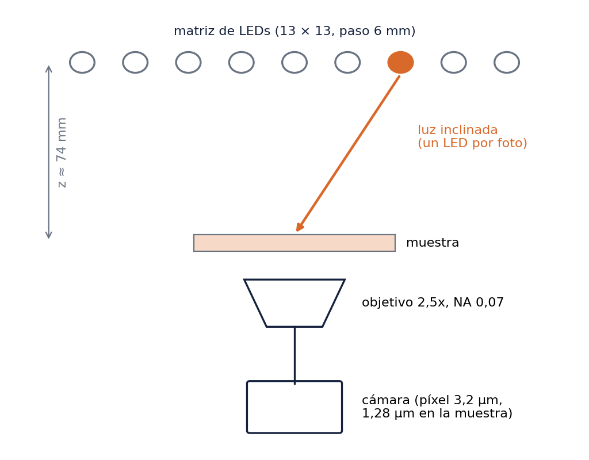
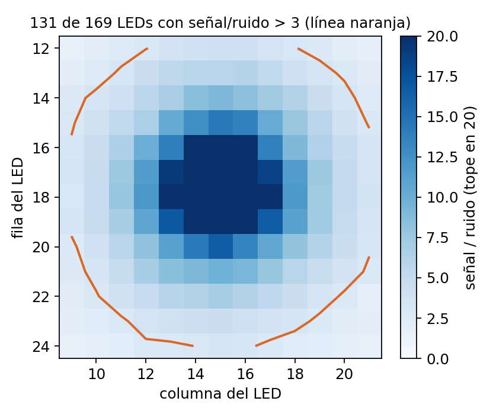
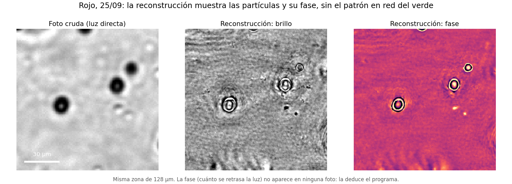
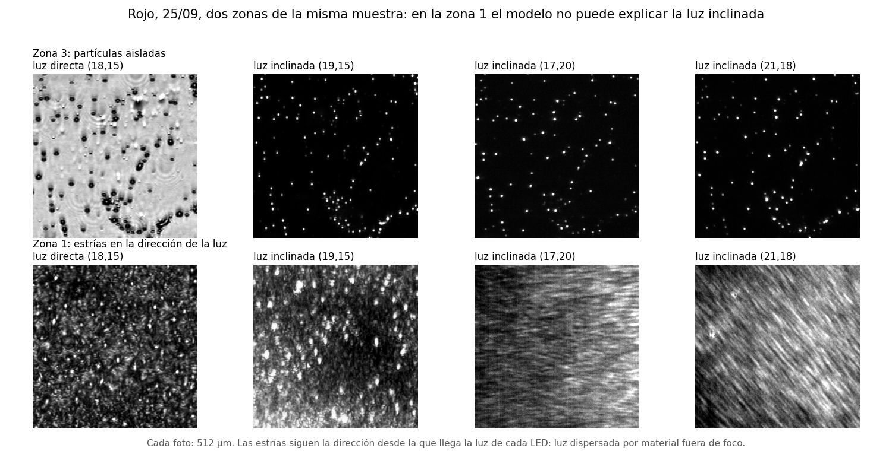

# Pipeline de microscopía pticográfica de Fourier multiespectral asistido por agentes

*Resumen del trabajo, septiembre de 2026. Lucas Costilla. Repositorio `reproducible-research-template`.*

## 1. El objetivo y dónde quedamos

Un microscopio no distingue detalles más chicos que cierto límite, que depende de la apertura numérica (NA) del objetivo y del color de la luz. Con nuestro objetivo de NA 0,07, ese límite es de unos [srcnum:resumen_abbe_verde_um:3.8] µm en luz verde [src:resumen_abbe_verde_um].

La **microscopía pticográfica de Fourier (FPM)** busca superarlo sin cambiar el objetivo. Una matriz de LEDs ilumina la muestra desde muchos ángulos, uno por foto, y un programa combina las fotos en una imagen de mayor resolución. De paso recupera la **fase**, es decir, cuánto se retrasa la luz al atravesar la muestra, algo que ninguna foto registra.

El proyecto se proponía tres cosas: (1) reconstruir con FPM cada color; (2) combinar los tres colores (rojo 630 nm, verde 530 nm, azul 470 nm) en una reconstrucción **multiespectral**; y (3) que **agentes de IA** asistan tanto dentro del pipeline (decidir, controlar la calidad, reportar) como en su desarrollo.

| pieza | estado |
|---|---|
| FPM por color, en simulación | **logrado** |
| FPM por color, con datos reales | **parcial**: se recupera la fase, pero no hay evidencia de ganancia de resolución |
| Combinación multiespectral, en simulación | **parcial**: funciona en el caso para el que fue diseñada, no en general |
| Combinación multiespectral, con datos reales | **no logrado**: primera comparación real el 28/09; el detalle reconstruido no coincide entre colores |
| Agentes dentro del pipeline | **construidos y probados en simulación**; con datos reales su juicio no fue confiable |
| Agentes en el desarrollo | **logrado**: encontraron los errores que invalidaban los resultados reales |

## 2. El montaje y las capturas

El montaje tiene una matriz de LEDs RGB con paso de 6 mm a unos 74 mm de la muestra, un objetivo 2,5x de NA 0,07 y una cámara de 12 bits con píxel de 3,2 µm (1,28 µm en la muestra). Se usan 13 × 13 = 169 LEDs, uno por foto y por color. La muestra son partículas de unos 5 µm (tamaño nominal; en la práctica, de tamaños variados) en DMSO.

| captura | qué tenía | para qué sirvió |
|---|---|---|
| 12/12/2025 | RGB, objetivo 2x NA 0,10 | primeras reconstrucciones, incluida una multiespectral; ahí aparecieron los errores de la sección 4 |
| 08/07/2026 | RGB, 1 ms para todos los LEDs | muy poca luz: solo [srcnum:resumen_leds_utiles_julio:12] de 182 LEDs llegaban al 10 % del brillo del más brillante [src:resumen_leds_utiles_julio] |
| 24/09/2026 | RGB, 1/10/100 ms por LED, fotos a oscuras | **receta nueva de exposición**: [srcnum:resumen_leds_utiles_2409:131] de 169 LEDs con señal/ruido mayor que 3 [src:resumen_leds_utiles_2409] |
| 25/09/2026 | solo rojo, dos zonas (sets 1 y 3), fotos a oscuras y **sin muestra** (flats) | la reconstrucción real más confiable (set 3) y el diagnóstico de por qué falla (set 1) |
| 28/09/2026 | RGB del **mismo campo**, foco fijo en verde, flats (oscuros saturados: se usaron los del 25/09) | la primera comparación multiespectral real (sección 5) |

{w=45}
{w=47}

Desde las imágenes se puede medir dónde cae el eje óptico respecto de la matriz: en diciembre, el ajuste del brillo por LED dio fila [srcnum:resumen_centro_fila:17.45] y columna [srcnum:resumen_centro_col:14.65] [src:resumen_centro_fila]; en septiembre, el eje cae entre los LEDs (17,15) y (18,15). La **altura** z, en cambio, no se puede fijar desde las imágenes (sección 5); se usó la medida a mano, 74 mm.

## 3. La cadena multiespectral, en simulación

El repositorio tiene un **simulador** del microscopio y un **programa de reconstrucción** por color (ePIE y Wirtinger flow). Además tiene una **cadena multiespectral**: lleva los tres colores a una grilla común, los reconstruye y los acopla desenvolviendo la fase con una longitud de onda sintética. Después ajusta la dispersión del material (cómo cambia el índice de refracción con el color) para obtener el **espesor** de la muestra.

- **Un color, con la geometría real y sin ruido:** el brillo reconstruido coincide con la muestra inventada en [srcnum:resumen_sint_amplitud:0.995] (1 = perfecto) [src:resumen_sint_amplitud] y la fase en [srcnum:resumen_sint_fase:0.87] [src:resumen_sint_fase]. Con la matriz a 100 mm, que da más solapamiento entre LEDs vecinos, la fase sube a [srcnum:resumen_sint_fase_z100:0.97] [src:resumen_sint_fase_z100].
- **Tres colores acoplados:** en un objeto diseñado para necesitar el acople, el espesor recuperado correlaciona [srcnum:multispectral_thickness_correlation:0.88] con el verdadero [src:multispectral_thickness_correlation], y el error es [srcnum:unwrapping_error_reduction_factor:183] veces menor que sin acoplar [src:unwrapping_error_reduction_factor].
- **El límite:** un barrido con el solver real sobre la magnitud de la fase (roadmap, milestone 20) muestra que acoplar **empeora** cuando no hace falta desenvolver, y solo rescata en parte cuando sí hace falta. La cadena funciona, pero no mejora en general sobre reconstruir cada color por separado.

## 4. Los agentes

**Dentro del pipeline** (`agents/`) hay tres agentes, construidos y probados en simulación. Los tres usan el propio Claude Code con respuestas de formato fijo:
- un **orquestador** que lee la convergencia de una reconstrucción y decide aceptar, reintentar con otro paso o declararla estancada;
- un agente de **control de calidad** que, sin la muestra verdadera, juzga si los tres colores son consistentes y si el resultado es confiable;
- un agente de **reporte**, que redacta cada hallazgo con sus números citados.

Con datos reales, el control de calidad (en modo de prueba, con una regla fija en vez del modelo) dio "confianza alta" a una reconstrucción de diciembre que en realidad estaba congelada. Los colores coincidían porque la fase casi no se había movido, no porque el acople funcionara. Sin buenas reconstrucciones, el juicio automático no distingue "bien" de "vacío".

**En el desarrollo**, los agentes trabajaron en tres modos:
- sesiones directas con una persona;
- agentes en paralelo para auditar;
- equipos con un **verificador** que rehace cada número con su propio código antes de aceptarlo.

Con eso aparecieron varios errores que daban resultados equivocados **sin avisar**:

| error | consecuencia | cómo se encontró |
|---|---|---|
| El paso de corrección era ~[srcnum:resumen_paso_congelado_factor:8000] veces más chico de lo debido con imágenes reales [src:resumen_paso_congelado_factor] | el programa devolvía casi la foto de partida: todo lo real anterior quedó invalidado, incluida la corrida multiespectral de diciembre | un agente que investigaba otra cosa; las pruebas usaban imágenes de 16–32 píxeles |
| La imagen de referencia (Zeiss, objetivo 2,5x, [srcnum:resumen_zeiss_um_px:2.344] µm/píxel [src:resumen_zeiss_um_px]) tenía menos detalle que una foto cruda | no servía para validar ganancia de resolución | rastreando su origen |
| Fotos sin corregir por exposición; escala inicial equivocada; las corridas de diciembre suponían otro objetivo | reconstrucciones sesgadas; geometría equivocada | revisando datos; el objetivo, al confirmar el hardware |
| Código previo (`ptyco-full-simulator`): el gradiente caía en frecuencias corridas (error de adjunto [srcnum:resumen_adjunto_error:1.41]; 0 es correcto) [src:resumen_adjunto_error], la pupila ocupaba toda la imagen y la orientación de los LEDs estaba traspuesta | esas reconstrucciones no reflejan la muestra | al adaptarlo a los datos del 25/09; confirmado por un verificador independiente |

## 5. Datos reales, color por color

Antes de mirar cada reconstrucción real se fijaron **cuatro criterios**, con umbrales calibrados en una simulación de la misma captura:
1. predice las fotos de LEDs que no usó;
2. dos reconstrucciones independientes, cada una con la mitad de los LEDs, coinciden en el detalle más allá del límite del objetivo;
3. no aparecen patrones que no están en la muestra;
4. aparece detalle nuevo.

**Verde, 24/09.** Predice fotos no vistas, pero está dominada por un patrón en red que cambia con decisiones del programa. Más señal no alcanzó para sacarlo.

**Rojo, 25/09, set 3.** Es la primera reconstrucción real que se parece a la muestra: se ven las partículas y su fase, sin el patrón en red.
- **Criterio 1, pasa:** error [srcnum:resumen_R_Ainit:0.517] contra [srcnum:resumen_R_sinfpm:0.991] sin reconstruir (1 = no mejor que una constante) [src:resumen_R_Ainit].
- **Criterio 2, falla:** las mitades coinciden [srcnum:resumen_frc_real:0.026], cuando el umbral era [srcnum:resumen_frc_umbral:0.143]; la simulación da [srcnum:resumen_frc_sint:0.185] [src:resumen_frc_real].
- **Criterio 4:** se recupera la fase, no resolución.

{w=54}

**Rojo, 25/09, set 1** (otra zona, con mucha más señal en campo oscuro; corrida del 28/09).
- **En simulación, con esa señal, todo pasa:** error [srcnum:resumen_set1_sint_R:0.440], mitades [srcnum:resumen_set1_sint_frc:0.191] [src:resumen_set1_sint_R].
- **Con los datos reales no predice nada:** [srcnum:resumen_set1_R:0.998] contra [srcnum:resumen_set1_sinfpm:1.000] sin reconstruir [src:resumen_set1_R].
- **La causa se ve en las fotos.** La luz inclinada está dominada por estrías que siguen la dirección de cada LED: luz dispersada por material fuera de foco, en el volumen de la muestra, que el modelo de muestra delgada no tiene. Es la explicación más directa de la "luz de más en campo oscuro" que también aparece, en menor medida, en el set 3.

{w=64}

**Los tres colores del mismo campo, 28/09.** Es la primera prueba multiespectral con datos reales.
- **Las fotos crudas de los tres colores coinciden entre sí** (correlación de [srcnum:resumen_rgb_crudas_min:0.71] a [srcnum:resumen_rgb_crudas_max:0.78]) [src:resumen_rgb_crudas_min]: es el mismo campo.
- **Las reconstrucciones solo coinciden dentro de la banda que el objetivo ya ve** (hasta [srcnum:resumen_rgb_banda_max:0.52]) [src:resumen_rgb_banda_max], y casi nada con todo el detalle (hasta [srcnum:resumen_rgb_todo_max:0.06]) [src:resumen_rgb_todo_max]. El detalle que agrega el programa no es el mismo en los tres colores, así que no es de la muestra. En ningún color coinciden tampoco las mitades (verde: [srcnum:resumen_rgb_frc_verde:0.024]) [src:resumen_rgb_frc_verde].
- **Solo el verde, el color enfocado, se parece a la muestra.** En rojo y azul las partículas salen agrandadas y con textura de red, y reenfocarlos numéricamente no lo corrige.
- **El rojo predice apenas las fotos no vistas:** [srcnum:resumen_rgb_R_rojo:0.901] contra [srcnum:resumen_rgb_sinfpm_rojo:0.992] sin reconstruir [src:resumen_rgb_R_rojo].

{w=50}

Otros dos indicios del mismo tipo:
- **La altura no se puede fijar desde las imágenes.** Con datos reales, el error sigue bajando, con altibajos, hasta z = 115 mm, donde llega a [srcnum:resumen_z115_R:0.437] [src:resumen_z115_R]. En la simulación, el mínimo cae en el valor verdadero: z está compensando un error del modelo.
- **Poco solapamiento entre LEDs vecinos:** solo [srcnum:resumen_solapamiento_pct:31] % [src:resumen_solapamiento_pct], en el límite bajo de lo recomendado para FPM.

## 6. Conclusión respecto del objetivo, y próximos pasos

El pipeline existe y funciona **en simulación**: por color, multiespectral y con agentes. Con datos reales se llegó a reconstruir la fase de un color. **El paso multiespectral real no se alcanzó.** La primera comparación entre colores del mismo campo (28/09) muestra que el detalle reconstruido no coincide entre colores. Hacen falta primero reconstrucciones por color confiables, y la muestra real sale del modelo de muestra delgada (set 1). Los agentes fueron más útiles para **auditar** (encontrar errores que nadie había visto) que para **juzgar** resultados reales sin referencia.

Próximos pasos:
1. **Repetir la captura RGB con los oscuros bien tomados y el foco de cada color registrado**, e incluir el foco de cada color en el modelo (desenfoque en la pupila), porque hoy solo el color enfocado da una reconstrucción creíble.
2. **Muestras más delgadas y menos densas**, o un modelo de muestra gruesa (multi-slice); y una muestra con detalle conocido más fino que el límite, como una placa de calibración o las pistas de un CD (1,6 µm).
3. **Separar volumen de celda:** fotos de la celda solo con DMSO y de la muestra desenfocada. En la misma toma, cuatro LEDs extra fijan la orientación de la matriz con signo.
4. **Más solapamiento:** matriz más lejos o LEDs más juntos.

## 7. Dónde está cada cosa

- **Código** del simulador, la reconstrucción y la cadena multiespectral: `src/ptyco_full_simulator/`. **Agentes:** `agents/`.
- **Reconstrucciones del 25/09:** `results/captura_2026-09-25_red/` (set 3) y `results/captura_2026-09-25_red_set1/` (set 1), cada una con su `INFORME.md` y sus `criterios.md`.
- **Historia de decisiones y hallazgos:** `docs/roadmap_agentic_multispectral_pipeline.md`, secciones 6.x.
- **Código previo, copia adaptada y parche:** `scripts/lucas_tpwfp/`.
- **Qué resolvieron los agentes y qué no:** el informe aparte (https://claude.ai/code/artifact/de7eab31-d9e0-4828-a62d-285ba0d46a98) y la presentación.
- **Este resumen:** `report/resumen/` (`make_figs.py`, `build.py`). Cada número tiene su fuente en `data/numbers.json` (anexo).
